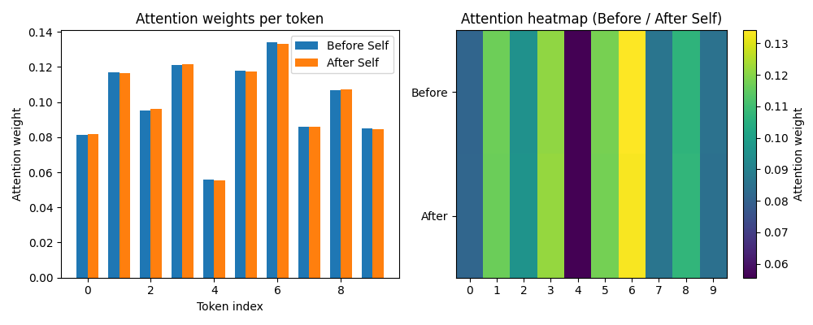

# Self-Conditioned Attention
### ― Minimal Structure for Direct Self-Intervention in Attention ―

**Author:** rs  
**Date:** 2025-11-28

---

## Abstract

This paper proposes **Self-Conditioned Attention**, a method to incorporate a "Self" (internal state) into the Transformer's Attention mechanism with minimal computational cost.  
Standard Attention handles only the relative relationships between input tokens and does not directly reflect the model's own history, traces, or internal states.  
Our approach allows a low-dimensional self-state vector $s_t$ to intervene directly in the Attention logit calculation, realizing **trace-sensitivity** and **self-induced deformation** of the generation distribution.

This structure is extremely simple, requiring no external memory modules, RNN structures, or meta-learning, making it easy to integrate into existing Transformers.  
Small-scale experiments demonstrate that by introducing the Self, the generation output changes based on history and internal state, even for identical inputs.

---

## 1. Problem Statement — Limitations of Standard Attention

While the Transformer's scaled dot-product attention handles relationships between tokens with high precision, **it lacks a structure to explicitly retain the model's own past traces or internal states and reflect them in generation.**

Standard Attention refers only to the following three elements:
- Input sequence (current set of tokens)
- Query / Key / Value embeddings
- Weighting via Softmax

However, conventional models do not possess structures to answer questions such as:
> *"How do past interpretations and traces affect future Attention?"*
> *"How does the attention distribution deform in an AI that has experienced Shock or Emotion?"*

---

## 2. Basic Structure of Self-Conditioned Attention

### 2.1 Introduction of Self State

The model maintains a low-dimensional internal self-state (Self) for each timestep or interaction episode:

$$
s_t \in \mathbb{R}^{d_s}
$$

Unlike standard hidden states, this Self is considered a compressed structure of **episodic or self-specific history**.

---

### 2.2 Standard Attention (Recap)

$$
Q = XW_Q \\
K = XW_K \\
V = XW_V
$$

The logit for standard Attention is:

$$
e_{ij}^{\text{base}} = \frac{Q_i K_j^\top}{\sqrt{d_k}}
$$

The weights and output are:

$$
\alpha_{ij} = \text{softmax}_j(e_{ij}) \\
H_i = \sum_{j=1}^L \alpha_{ij} V_j
$$

---

### 2.3 Minimal Structure for Self Intervention

The fundamental equation for Self-conditioned Attention is:

$$
e_{ij} = e_{ij}^{\text{base}} + b(s_t)
$$

As a minimal form, we use a uniform bias derived from the Self:

$$
b(s_t) = u^\top s_t
$$

Where:
- $u \in \mathbb{R}^{d_s}$: Learnable weights.
- This term **globally deforms the intensity or preference of Attention according to the state of the Self**.

---

### 2.4 Update Rule for Self (Simplest Form)

Since the Self has the property of "accumulating traces," it can be updated as follows:

$$
s_{t+1} = s_t + \eta \cdot g(z_t, s_t)
$$

- $z_t$: Aggregation of the current hidden state (e.g., mean pooling).
- $g$: A small MLP or linear transformation.
- $\eta$: Learning rate.

---

## 3. Experimental Design (Minimal Configuration)

### 3.1 Toy Sequence Experiment
- **Vocabulary size:** 10–50 tokens
- **Transformer layers:** 1–2 layers
- Observation of Self changes after the appearance of "Shock Tokens" or "Emotion Markers."
- Comparison of generation with and without Self.

### 3.2 Evaluation Metrics

| Metric | Meaning |
|:---|:---|
| **Perplexity** | Prediction accuracy. |
| **KL Divergence** | The degree to which output is distorted by Self differences for identical inputs. |
| **Attention Heatmap** | Visualization of changes in attention distribution. |
| **Self Norm / Trajectory** | Geometric observation of Self changes. |

---

## 4. Key Results (Core Concepts)

### 4.1 Baseline Verification (Sanity Check)

Before introducing bias, we verified that a Self with random/neutral experience does not inherently distort reality. The figure below confirms the **Identity Mapping** (Before ≈ After) under random input conditions.

*Fig 1: Comparison of Attention weights before and after Self intervention (Random Baseline).*

### 🔹 Self "Deforms" Attention
- When the value of Self changes, the Attention map distorts systematically.
- **Even if the input is the same, the output changes if the internal state differs.**

### 🔹 Self is not "Memory" but a "Source of Distortion"
- It is not merely a storage of the past but functions as a **structure that transforms the current interpretation space**.

### 🔹 Basis for Geometric Interpretation of Attention
- If Self is small, the space is nearly Euclidean.
- As Self accumulates, the Attention space distorts (= Identity deformation).

---

## 5. Comparison with Related Work (Strength of Minimalism)

| Method | Difference |
|:---|:---|
| **RNN Hidden State** | Can retain history, but does not directly affect Attention weights. |
| **Memory-Augmented Network** | Complex, relies on external modules. |
| **Meta-learning / Fast Weights** | High cost, often black-box in nature. |
| **Self-conditioning (e.g., T5)** | Self-input within layers, but not a Persistent Self. |
| **This Work** | **Minimal structure injecting Self directly into Attention logits.** |

---

## 6. Limitations and Future Prospects

### Current Limitations
- Self is limited to a scalar or low-dimensional vector.
- Affect / Shock / Imprint Energy are not yet fully implemented.
- This paper serves only as a minimal template for "injecting Self into Attention."

### Future Directions
| Next Step | Content |
|:---|:---|
| **Trace Tensorization** | Expanding Self into a high-dimensional tensor for geometric structures. |
| **Affect Introduction** | Treating Self as an "Emotional Gradient" to non-linearly distort Attention. |
| **Active Inference Integration** | Connection with Free Energy minimization. |
| **Integration with SIA** | Connecting this structure with SIA elements (Shock, Trace, Affect). |

---

## 7. Conclusion

Self-Conditioned Attention is the **minimal structure for "injecting Self into Attention in the simplest form."**

Through this structure, we have defined the phenomenon:
> *"When the Self changes, Attention distorts, and the generation distribution changes."*

as an explicit mathematical formula for the first time.

This mechanism serves as the **"smallest, yet unbroken scaffolding"** for building the complete version of SIA.

---

## References (Placeholder)

- Vaswani et al. Attention Is All You Need. 2017.
- Graves et al., Neural Turing Machines, 2014.
- Ba et al., Using Fast Weights to Attend to the Recent Past, 2016.
- Friston, Active Inference and Free Energy, 2010.
- Sawaki, Self-Imprint Attribution (Unpublished Draft), 2025.