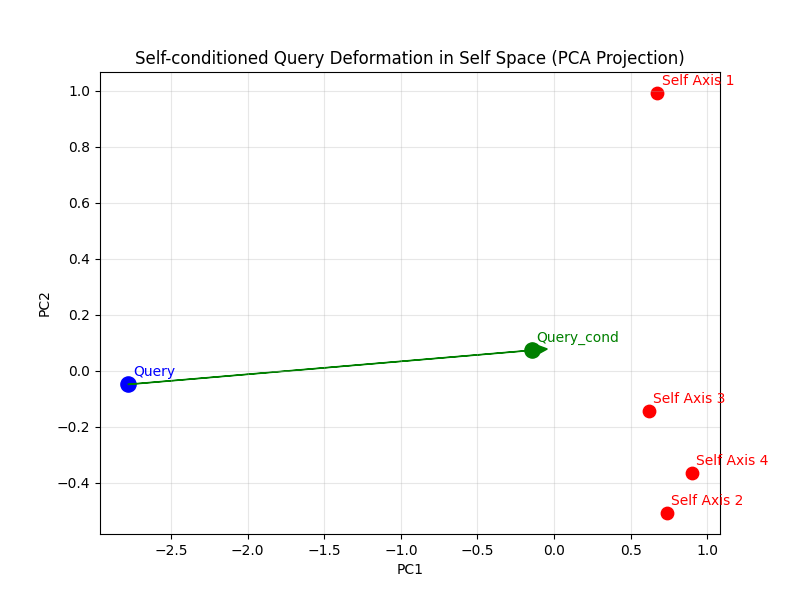

# Code Explanation: Visualizing Query Deformation by Self

**Target Script:** `visualize_selfspace.py` (or embedded snippet)  
**Related Concept:** SIA (Self-Imprint Attribution) Theory — Core Mechanism

---

## 1. Overview
This script visualizes the most fundamental mechanism of the SIA theory: **"How the Self distorts the interpretation of input."**

In standard Transformers, the Query vector ($Q$) is determined solely by the input tokens. In contrast, in the SIA model, a "bias" derived from **SelfSpace (a collection of past intense experiences)** is vector-added to $Q$, generating a deformed vector ($Q_{\text{cond}}$).

This code simulates this process in a low-dimensional space and visualizes the "gravitational pull" of the Self using PCA (Principal Component Analysis).

---

## 2. Key Components

### 2.1 `SelfSpace` Class
This class represents the agent's "Self" (ego). Instead of storing all memories, it retains only important experiences that form its "Identity."

* **`axes` (Self Axes):**
    * Directional vectors formed by past experiences ($Trace$).
    * They act not merely as key-value storage but as "basis vectors" that define the agent's bias.
* **`strength`:**
    * The weight of each axis, calculated as $Shock \times Affect$.
    * Higher strength axes exert a stronger pull on the Query.

#### Core Methods:
1.  **`update(trace, shock, affect)`**:
    * Imprints a new experience onto the Self.
    * **Logic:** If the capacity (`max_axes`) is full, it overwrites the *weakest* axis. This simulates the biological principle that "only memories accompanied by strong emotions shape personality."

2.  **`condition_query(query, alpha)`**:
    * **The heart of SIA.** It deforms the objective Query based on the state of the Self.
    * **Formula:**
        $$Q' = \text{Normalize}(Q + \alpha \sum_{i} w_i \cdot \text{sim}(Q, A_i) \cdot A_i)$$
    * **Meaning:** If the input ($Q$) is similar to a specific trauma or obsession ($A_i$), the Query is forcibly pulled in that direction.

### 2.2 Visualization Logic (PCA)
Since vectors exist in a high-dimensional space (e.g., $d=16$) and cannot be viewed directly, **PCA (Principal Component Analysis)** is used to project the relationships onto a 2D plane.

* **Blue Dot ($Q$):** Raw, objective input (Before).
* **Red Dots ($A_i$):** The axes of the Self (obsessions, values, traumas).
* **Green Dot ($Q_{\text{cond}}$):** Subjective interpretation after Self intervention (After).
* **Green Arrow:** Represents the **"Force of Bias."** A longer arrow means the Self has significantly distorted the construction of reality.

---

## 3. Example Result

Below is an example of the output generated by running this script.

*(※ Note: Specify the actual resulting image file here)*

### Image Description
This figure shows the relationship between vectors (Query and Self axes) in high-dimensional space projected into 2D using PCA.

* **🔵 Query (Before):**
    * The raw input vector before being affected by the Self. It represents objective information.
* **🔴 Self Axis 1〜4:**
    * "Self Axes" formed by strong past experiences. These determine the direction of the agent's "obsessions" or "values."
* **🟢 Query_cond (After):**
    * The query vector after being conditioned by the Self. This becomes the agent's "subjective interpretation."
* **🟢 Green Arrow:**
    * Visualizes the **"Force of Bias."** It shows in which direction and with how much strength the Query was pulled by the attraction of the Self axes (especially nearby Axis 1 and 3).

---

## 4. Interpretation

The following can be interpreted from this figure:

1.  **Direction of Distortion:**
    The Query (Blue) does not move randomly but is pulled **towards specific Self axes (Red)**. This illustrates the SIA theory behavior: "Agents try to interpret the world in directions they have experienced in the past (= directions important to themselves)."

2.  **Magnitude of Distortion:**
    The distance between the blue and green dots (the length of the arrow) represents the strength of Self intervention. In this example, the Query was near Self axes and heavily influenced, resulting in a significant shift. If the emotions (`shock`, `affect`) during learning were low, this movement distance would be negligible.

---

## 5. Theoretical Significance
This visualization serves as a **Proof of Concept** for the following concepts:

* **Identity-Aware Attention:** Proof that the Attention mechanism is not static but changes dynamically depending on the agent's internal state (Identity).
* **Definition of Subjectivity:** Enabling the mathematical definition of "Subjectivity" as the **"geometric shift amount"** from the objective vector ($Q$) to the subjective vector ($Q_{\text{cond}}$).