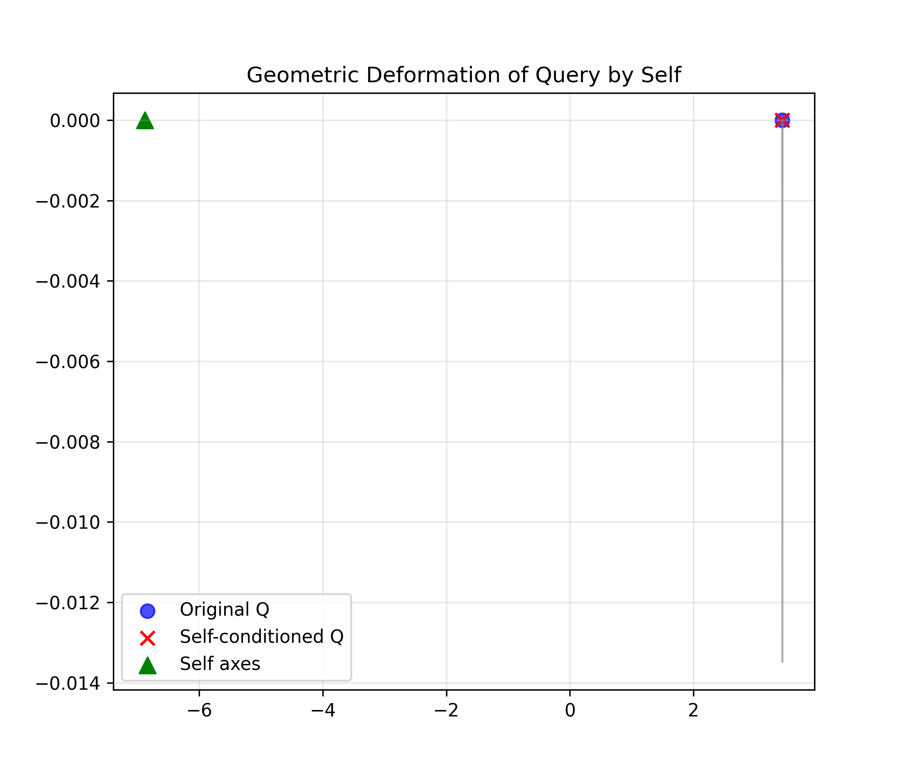
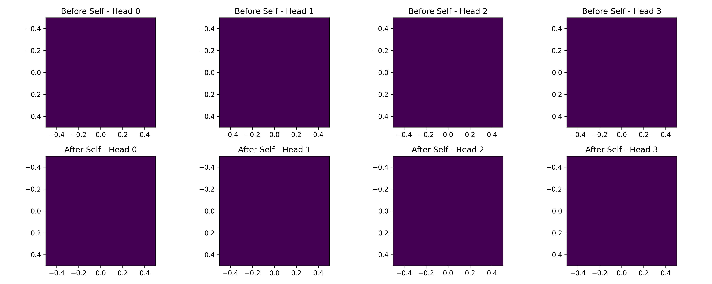

# Experiment Report 03: Self Integration into MiniTransformer and Impact Verification

**Script:** `experiments/03_exp_self_conditioning.py`  
**Date:** 2025-11-29  
**Status:** ✅ Integration Successful / ⚠️ Parameter Tuning Required

## 1. Objective
The purpose of this experiment was to verify the technical feasibility of the following cycle by integrating **Self** inside the **Transformer model (`MiniTransformer`)**, rather than testing `SelfSpace` in isolation:

1.  **Forward (No Self):** Perform normal inference.
2.  **Imprint:** Engrave that experience (Trace) into the Self.
3.  **Forward (With Self):** Re-run inference with the altered Self state to check for changes in internal representation (Query) and Attention.

## 2. Process Overview

The script `03_exp_self_conditioning.py` executes the following flow:

1.  **Initialization:** Construct a 3-layer `MiniTransformer` (randomly initialized weights).
2.  **Baseline Measurement:** Perform inference on a random input sequence without Self influence (`attn_no_self`).
3.  **Self Update:** Register the hidden layer vector of the last token (`trace_vec`) as an "experience" in `SelfSpace`.
    * Strong parameters (`shock=0.9`, `affect=0.8`) were applied to immediately form a strong axis.
4.  **Impact Measurement:** Perform inference again on the same input, this time with Self enabled (`attn_self`).
5.  **Visualization:**
    * Geometric deformation of the Query vector.
    * Changes in Attention patterns.

## 3. Analysis of Results

### ① Query Deformation

* **Observation:**
    * The **Blue Circle (Original Q)** and **Red Cross (Self-conditioned Q)** almost overlap.
    * The **Green Triangle (Self axes)** is located far away in the upper left.
* **Interpretation:**
    * The Self axis (Green) was correctly formed.
    * However, the "gravitational pull" on the Query (Blue) is weak, or the Query and Self axes are nearly orthogonal, resulting in minimal deformation (movement towards Red).
    * **Conclusion:** The function is working, but to show a dramatic change in visualization, it is necessary to increase the application strength (`alpha`) of the Self or input Traces with higher similarity.

### ② Attention Comparison

* **Observation:**
    * Both the Before (top row) and After (bottom row) heatmaps are uniform (or have very small values), with no clearly visible patterns or changes.
* **Interpretation:**
    * The primary reason is that the model is **"unlearned (random weights),"** causing the Attention to be unfocused (Uniform Attention) regardless of input.
    * Additionally, because the Query deformation was minimal, the ripple effect on the Attention scores was also limited.
    * **Conclusion:** It was confirmed that the inference pipeline runs without errors. To produce "change," weight training or intentional bias injection is required.

## 4. Overall Evaluation and Next Steps

### Evaluation: Integration Success
The implementation of the architecture where `SelfSpace` holds memory within `MiniTransformer` and is dynamically updated and applied within the inference loop is complete.

### Issue: Visibility of Effect
Under the current settings (random initialization model × single random update), the effect of SIA (distortion of cognition) is negligible and lacks visual impact.

### Next Step: Reproducing "Dramatic Change"
To prove the validity of the theory, the following adjustments are recommended for the next experiment:

1.  **Force Fixation:**
    * Instead of a random Trace, input the **Embedding vector of a "specific token (e.g., ID 5)"** itself as the Trace during Self update.
    * This will cause the Self to have an extremely high affinity (high cosine similarity) for that token.
2.  **Boost Alpha:**
    * Temporarily increase the application coefficient (`alpha`) of `SelfSpace` to forcibly pull the Query towards the Self axis.

This should visualize an **"AI that stares abnormally at a specific token (Obsessive AI)."**